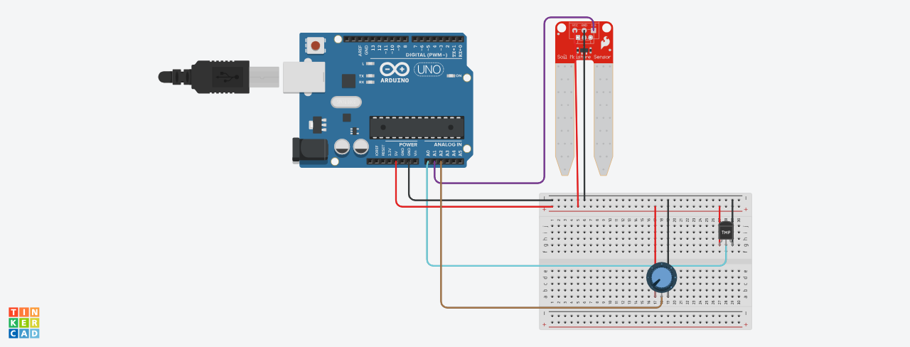
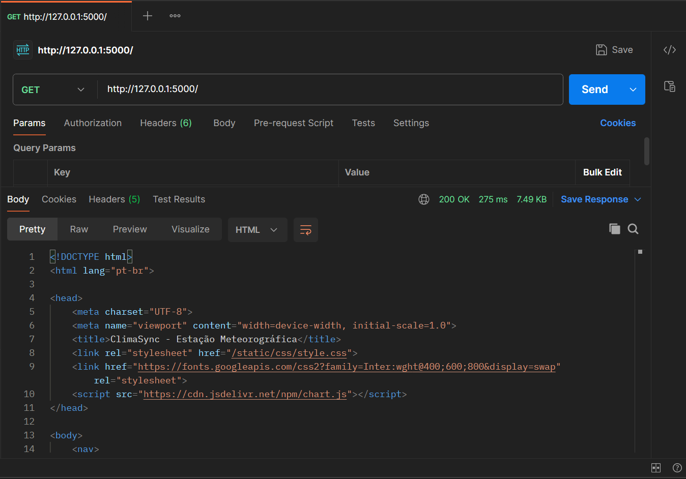
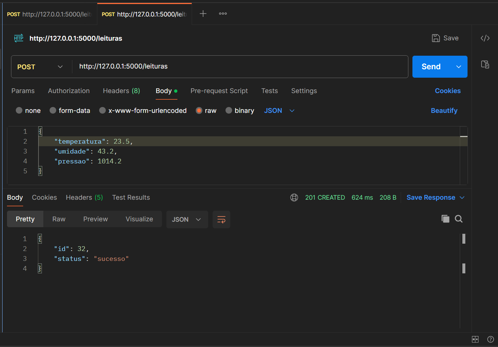
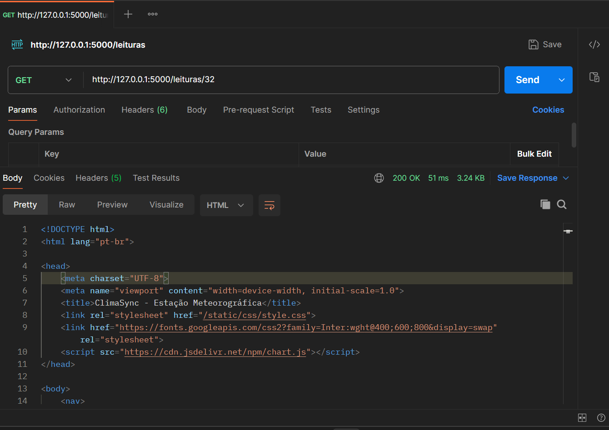
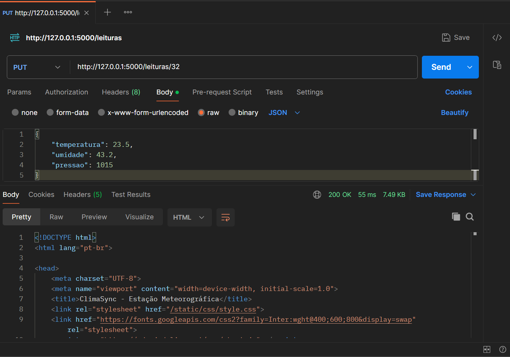
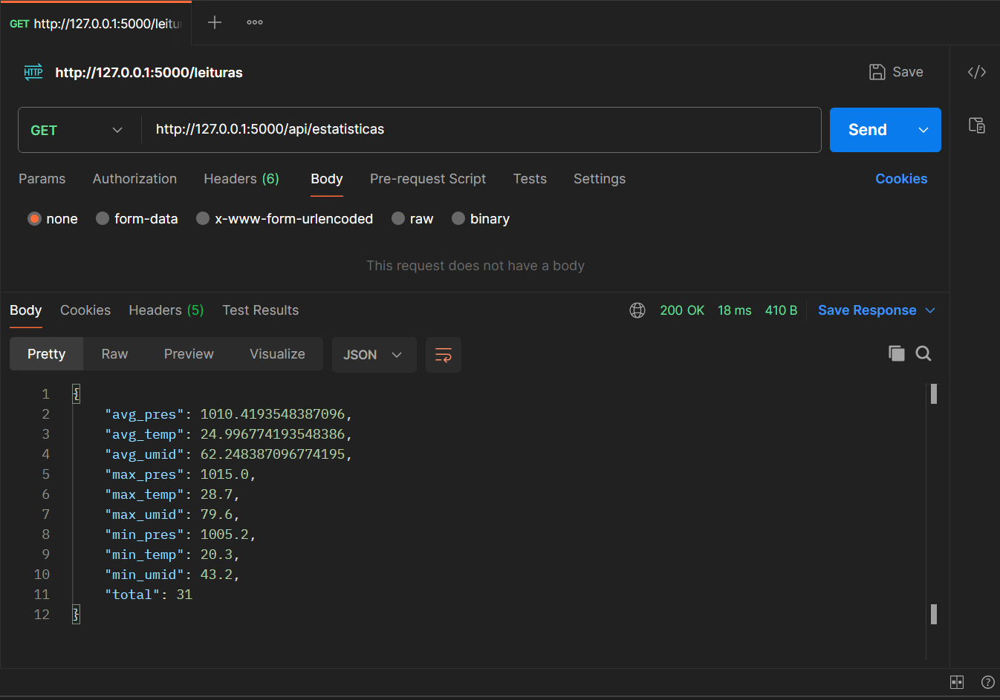
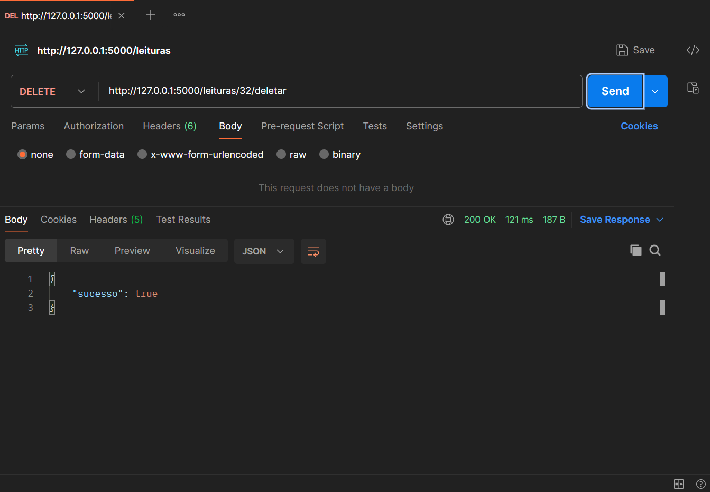

# ClimaSync - Estação Meteorológica

Este projeto consiste em uma estação meteorológica integrada com um backend em Flask e banco de dados SQLite. Ele permite o monitoramento em tempo real de temperatura, umidade e pressão, oferecendo tanto uma interface web moderna quanto uma API REST para integração com dispositivos embarcados (como Arduino/ESP32).

## Como Executar

### Pré-requisitos
- Python 3.x instalado.

### Passo 1: Configurar ambiente virtual
```bash
# Crie o ambiente virtual
python -m venv venv

# Ative o ambiente virtual
# No Windows:
.\venv\Scripts\activate
# No Linux/macOS:
source venv/bin/activate
```

### Passo 2: Instalar dependências
```bash
pip install flask
```

### Passo 3: Rodar a aplicação
```bash
python src/app.py
```
Acesse `http://127.0.0.1:5000` no seu navegador.

---

## Descrição das Rotas

A API suporta respostas em **HTML** (padrão para navegadores) e **JSON** (adicionando `?formato=json` na URL).

| Método | Rota | Descrição |
| :--- | :--- | :--- |
| **GET** | `/` | **Dashboard**: Últimas 10 leituras e estatísticas com gráficos. |
| **GET** | `/leituras` | **Histórico**: Lista paginada de todos os registros. |
| **POST** | `/leituras` | **Criar**: Recebe JSON `{"temperatura": X, "umidade": Y, "pressao": Z}`. |
| **GET** | `/leituras/<id>` | **Detalhe**: Exibe ou edita um registro específico. |
| **PUT/POST**| `/leituras/<id>` | **Atualizar**: Altera os dados de um registro existente. |
| **DELETE** | `/leituras/<id>/deletar` | **Remover**: Exclui um registro do banco de dados. |
| **GET** | `/api/estatisticas` | **Métricas**: Retorna JSON com médias, mínimas e máximas. |


## Hardware e Sensores

Para o desenvolvimento desta estação, foi necessária uma adaptação entre o hardware sugerido nas instruções originais e o hardware disponível para simulação no **Tinkercad**.

| Componente | Hardware Sugerido (Original) | Hardware Utilizado (Simulação Tinkercad) | Justificativa |
| :--- | :--- | :--- | :--- |
| **Microcontrolador** | Arduino Uno (ou compatível) | Arduino Uno R3 | Plena compatibilidade. |
| **Temp. e Umidade** | Sensor DHT11 / DHT22 | **TMP36** (Temperatura) e **Sensor de Solo** (Umidade) | O Tinkercad não possui o DHT11. O TMP36 e o Sensor de Solo permitem simular as mesmas variáveis analógicas interativamente. |
| **Pressão Atm.** | Sensor BMP180 / BMP280 | **Potenciômetro** | Simulação da variação da pressão barométrica (mapeada para 950-1050 hPa) via entrada analógica. |
| **Acessórios** | Resistor 10kΩ, Jumpers, Protoboard | Jumpers e Protoboard | O resistor de pull-up do DHT11 não foi necessário para os sensores analógicos utilizados. |

---

## Circuito Simulado

A imagem abaixo apresenta a montagem do sistema no simulador:



---

## Estrutura do Projeto

- `src/app.py`: Servidor Flask e definição das rotas.
- `src/config.py`: Centralização de parâmetros e variáveis de ambiente.
- `src/database.py`: Lógica de manipulação do banco de dados SQLite.
- `src/schema.sql`: Definição das tabelas do banco de dados.
- `src/static/css/style.css`: Estilização da interface.
- `src/static/images/circuito.png`: Imagem do circuito.
- `src/templates/`: Arquivos HTML (Jinja2).
- `dados.db`: Arquivo do banco de dados (gerado automaticamente).

---

## Validação da API (Testes Postman)

Antes da integração com o front-end, as rotas foram validadas via Postman para garantir a integridade dos dados e o suporte ao formato JSON.

### Teste de Endpoint: Dashboard (JSON)


### Teste de Endpoint: Histórico de Leituras (JSON)


### Teste de Endpoint: Criação de Registro (POST)


### Teste de Endpoint: Detalhe de Registro (JSON)


### Teste de Endpoint: Atualização de Registro (PUT/POST)


### Teste de Endpoint: Métricas Estatísticas


### Teste de Endpoint: Deleção de Registro

